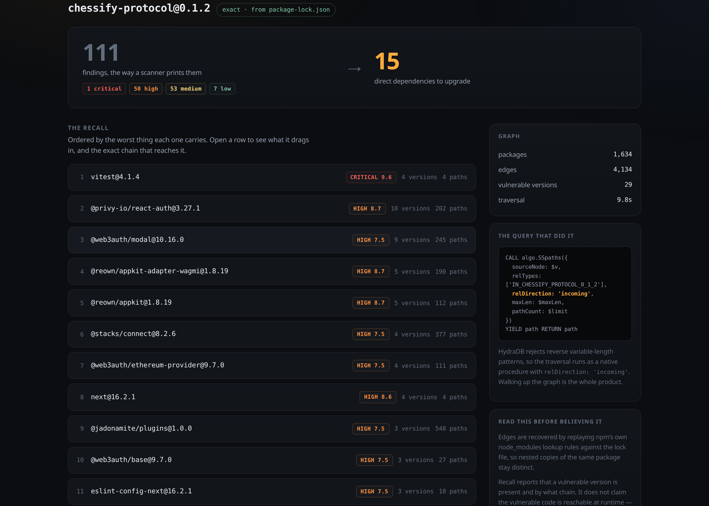
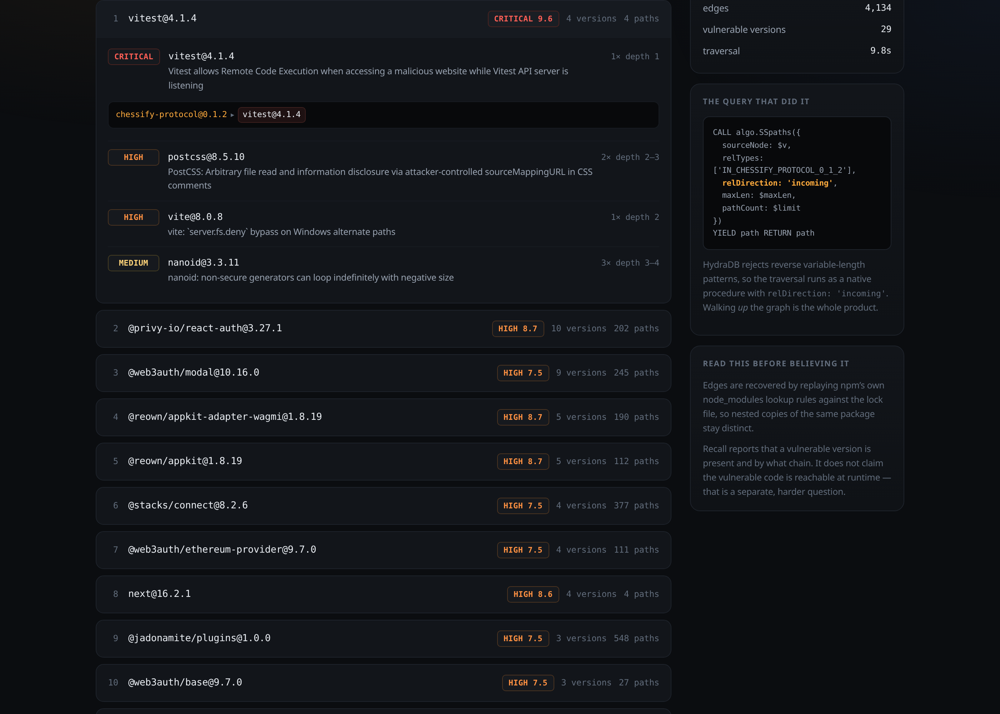

# Recall

**The product-recall query for software supply chains.**

Dependency scanners tell you *which packages are vulnerable*. No manufacturer has run a recall that way since the 1970s. When a bad component lot is found, a manufacturer runs the bill of materials **upward** — which sub-assemblies used it, which finished products used those, which units shipped, which owners to write to. Software borrowed the phrase "bill of materials" and never implemented the query that makes one useful.

Recall implements it. Point it at a real project:

```
$ npm run recall ~/code/my-app

my-app@0.1.2  ·  exact (package-lock.json)
  1634 packages · 4134 edges

111 findings across 29 vulnerable versions
  1 critical · 50 high · 53 medium · 7 low
↓
15 direct dependencies to upgrade:

  CRITICAL 9.6    4 vulnerable versions ·    4 paths · vitest@4.1.4
  HIGH 8.7       10 vulnerable versions ·  202 paths · @privy-io/react-auth@3.27.1
  HIGH 7.5        9 vulnerable versions ·  245 paths · @web3auth/modal@10.16.0
  HIGH 8.7        5 vulnerable versions ·  190 paths · @reown/appkit-adapter-wagmi@1.8.19
  …

worst chains:
  [1] my-app@0.1.2 → vitest@4.1.4
      CRITICAL  GHSA-9crc-q9x8-hgqq  Vitest allows Remote Code Execution …
  [2] my-app@0.1.2 → viem@2.48.11 → ws@8.18.3
      HIGH  GHSA-96hv-2xvq-fx4p  ws: Memory exhaustion DoS from tiny fragments …
```

**111 findings became 15 upgrades.** Not by filtering anything out — every finding is still there. By asking the question a scanner cannot ask: *by what path does this reach me?* Every path enters through exactly one direct dependency, and that is the only thing you can actually change.



**Start here** — [what it does](#why-the-flat-list-fails) · [live demo](https://recall-brown.vercel.app)
· [**how HydraDB is used**](#how-hydradb-is-used) · [run it yourself](#run)
· [attribution](#attribution) · [license](#license) (MIT).
The traversal is `src/query.js`; the report that wraps it is `src/project.js`.

## Why the flat list fails

`npm audit` on a real project prints hundreds of findings with two fatal properties:

1. **It is a list, not a path.** You cannot tell *how* the bad thing reaches you, so you cannot tell which single upgrade kills thirty findings at once.
2. **Most of it is unreachable.** The vulnerable function is frequently never called on any path your code takes.

The result is alert fatigue — the defining failure of the category. Developers learn the output is mostly noise and stop reading it. The UI ships the flat list too, behind a toggle, so you can see the same data both ways.

## The web UI

**Live → https://recall-brown.vercel.app**  ·  the tool itself at [`/app`](https://recall-brown.vercel.app/app/)

The landing page makes the argument with measured numbers; `/app` is the working tool, showing a **recorded scan** that says so on the page. Recall cannot run on a serverless host: the traversal needs a Bolt connection to a HydraDB node, resolution reads a lock file off disk, and a first scan of an unseen project queries OSV for hundreds of package names. So the demo is the real UI rendering a real scan — [jitsi/jitsi-meet](https://github.com/jitsi/jitsi-meet)'s committed lock file, 1,920 packages, **135 findings collapsed onto 40 upgrades** — computed locally and published with the page. Nothing is trimmed or invented, and anyone can re-run it.

To run it live against your own project:

```bash
npm run ui      # http://127.0.0.1:7676
```

Paste a `package-lock.json` or point it at a directory. Findings on the left, the upgrades they collapse onto on the right, and the traversal that connects them shown verbatim in the sidebar — open any row to walk the chain hop by hop.



It binds to loopback only: it reads paths on the local filesystem and talks to an unauthenticated local graph node, neither of which belongs on a public interface.

## Resolution: exact, or honestly labelled

A dependency graph built from *current* package versions finds almost nothing, because current versions are mostly patched. Real projects are not. Recall resolves the tree the project actually has:

| Input | Fidelity | How |
|---|---|---|
| `package-lock.json` (v2/v3) | **exact**, offline | Replays npm's own `node_modules` lookup rules against the lock file's paths |
| `package.json` | approximate | Ranges resolved against deps.dev — what npm *would* install today |

The lock-file path matters more than it sounds. npm's resolution is positional: a dependency is satisfied by the nearest `node_modules/<name>` walking up the directory chain, so one project routinely holds several live copies of the same package at different versions. Replaying that rule keeps them distinct — a flat scanner collapses them and loses the very edge you needed. Eight tests in `test/resolve.test.js` cover the cases that bite: hoisting, shadowing, scope walk-up, workspace links, optional deps.

When there is no lock file, the report says *"resolved as npm would install today"* on its face rather than quietly implying it knows what you are running.

## How HydraDB is used

Recall is a graph query wearing a CLI. HydraDB is not a cache or a side index —
it holds the bill of materials and answers the recall itself. Take it out and
there is no product left.

### The graph

| Element | Shape |
|---|---|
| `(:Package)` | `id` · `key` = `name@version` · `name` · `version` · `seed` |
| `(:Advisory)` | `id` · `osv` (GHSA/CVE) · `severity` · `summary` |
| `[:DEPENDS_ON]` | every dependency edge ever loaded — the union graph |
| `[:SEED_GRAPH]` | the committed crawl only, so a question about the ecosystem cannot be answered with somebody's scanned project |
| `[:IN_<ROOT>]` | one type per scanned project, carrying that project's tree alone |
| `[:HAS_ADVISORY]` | version → advisory, drawn only where that concrete version falls inside a compromised window (`src/windows.js`) |

### Writing it

`src/load.js` (the committed dataset) and `src/project.js` (a scanned project),
both batched through `src/bolt.js`. HydraDB rejects properties folded into a
`MERGE` pattern, so every upsert is MERGE-by-id followed by `SET`:

```cypher
UNWIND $rows AS row
MERGE (n {id: row.id})
SET n:Package, n.key = row.key, n.name = row.name,
    n.version = row.version, n.seed = row.seed
```

Node ids must be non-negative integers *and* integer-typed on the wire — so
package keys live in a `key` property with `data/idmap.json` translating, and
every id crosses the wire wrapped in `neo4j.int()`.

### The read that is the product

From `src/query.js`, exported verbatim so the UI can show the query that
produced what is on screen rather than a prettified retelling of it:

```cypher
CALL algo.SSpaths({
  sourceNode: $v,
  relTypes: ['DEPENDS_ON'],
  relDirection: 'incoming',
  maxLen: $maxLen,
  pathCount: $limit
})
YIELD path RETURN path
```

`relDirection: 'incoming'` walks the dependency edges **backwards** — from the
compromised version up through everything that ships it. That one parameter is
the recall. Paths return as `{start, segments, end, length}` and are reversed in
code so each chain reads app-first.

Every question this tool asks is a path question, which is why it is a graph
and not a table: a relational schema answers these with recursive CTEs that fall
over at depth, and a vector store cannot express them at all, because **"reaches"
is not a distance**.

### The four queries

| Query | Question | Mechanism |
|---|---|---|
| `vulnerable` | What is compromised in the graph? | advisory edges, version-window filtered |
| `recall <pkg>` | Who ships this, and by what chain? | reverse traversal, paths returned |
| `blast <pkg>` | How far does it reach? | reachable subgraph + depth profile |
| `cuts <pkg>` | What do I actually fix? | rank by paths severed per upgrade |

All four are `src/query.js` subcommands, against the whole graph. `src/project.js` runs the same traversal scoped to one real project's root, which is the form the UI uses.

### The Cypher subset, and what it shaped

HydraDB speaks a deliberately narrow OpenCypher subset. Each of these cost a
debugging round; between them they shaped the loader and every query:

- auto-commit `RUN` only — explicit transactions are rejected
- node ids are **non-negative integers**, so package keys live in a `key` property behind an id map
- parameters must be integer-typed on the wire (`neo4j.int()`), or they arrive as floats and are refused
- vertex upsert is `MERGE`-by-id followed by `SET`; folding properties into the `MERGE` pattern is rejected
- `SET` values must read from the row map — a literal in an `UNWIND` write is rejected
- no `IN`, `CONTAINS`, `IS NULL`, or `RETURN *`
- reverse variable-length patterns are unsupported, so the reverse traversal runs as the native `algo.SSpaths` procedure with `relDirection: 'incoming'` — that one parameter *is* the recall
- `algo.SSpaths`'s `pathCount` caps returned paths across the whole store, so each scanned project's edges are also written under a relationship type private to that project. Without it, one project's paths can crowd out another's and a genuinely reachable vulnerability reads as unreachable — which is exactly the silent false negative this tool exists to avoid.

## Version windows

An advisory is not a property of a package — it is a property of a *version range*. Recall pulls every advisory that ever affected each package name, with its `introduced → fixed` windows, then classifies each concrete version as:

- `inside` — sits in an affected window (exposed)
- `patched` — at or above the fix
- `before` — predates every window
- `unknown` — unparseable, and deliberately never treated as safe

## Severity

OSV records severity inconsistently: sometimes a label, sometimes a CVSS vector and nothing else, frequently both a v3 and a v4 vector on the same advisory. A vector is not a severity until someone scores it, so `src/severity.js` computes the **CVSS v3.x base score** from the vector using the published formula (tested against the specification's own worked examples).

CVSS v4 vectors are **not** scored. The v4 formula is a lookup table, not a closed form, and running a v3 equation over a v4 vector would produce a confident number that is simply wrong. Those report as `UNRATED`.

## Architecture

```
src/ingest.js            seed dependency graph from deps.dev, resume-safe
src/advisories.js        OSV exact-version scan
src/advisory-history.js  OSV per-name advisory windows — the time dimension
src/windows.js           semver window classification (pure, tested)
src/severity.js          CVSS v3.x base scoring (pure, tested)
src/resolve.js           real projects → nodes + edges (lock file or manifest)
src/load.js              batched idempotent load into HydraDB over Bolt
src/project.js           resolve → backfill → upsert → recall → report
src/query.js             the graph queries + CLI
src/server.js            zero-dependency local web UI
src/ingest-public.js     public repos' lock files → the shared graph
src/bolt.js              batched writes that survive the driver's packing fault
src/build-demo.js        bake a real scan into a static, deployable page
src/build-site.js        measure the landing page's dataset from the graph
public/index.html        the tool, single file
site-next/                the landing page — a separate Next.js app,
                         not required to run anything above
scripts/hydradb.sh       start a local HydraDB node
```

Building the static demo:

```bash
node src/build-demo.js <dir-or-lockfile> --dev --source <repo-url>
# → dist/index.html + dist/demo.json, deployable as plain static files
```

## Run

### Requirements

| Need | Version | Why |
|---|---|---|
| **Node.js** | ≥ 20 · built and tested on 24.14 | ESM, `node --test`, built-in `fetch` |
| **npm** | any current | two runtime dependencies, no build step |
| **A HydraDB node** | reachable over Bolt, default `127.0.0.1:7687` | everything except `npm test` |
| **Network** | only to scan a project the graph has not seen, or to rebuild the dataset | the committed dataset and all 37 tests run offline |

Runtime dependencies are `neo4j-driver` (Bolt client — HydraDB speaks Bolt) and
`semver`. That is the whole list: `src/server.js` uses only Node's standard
library and `public/index.html` is a single file with no bundler. The landing
page under `site-next/` is a separate Next.js app with its own `package.json`
and nothing in `src/` depends on it.

### Quick start

The crawled dataset is committed — 2,270 packages, 4,557 edges and 979 advisory
windows in `data/` — so there is no waiting on a crawl to see this work.

```bash
npm install
npm test                            # 37 tests, no network, no database

scripts/hydradb.sh                  # start the graph node (see below)
npm run load                        # load the committed graph into HydraDB (~2s)
npm run recall ~/code/my-app        # the recall, on a real project
npm run ui                          # the same thing, in a browser

node src/query.js vulnerable
node src/query.js recall brace-expansion@1.1.12
node src/query.js cuts   brace-expansion@1.1.12
```

Rebuilding the dataset from scratch is `node src/ingest.js` then `node src/advisory-history.js`; both are resume-safe and take a while.

### Environment

Nothing is required — every variable has a working default, and there is no
`.env` file to create.

| Variable | Default | Read by |
|---|---|---|
| `HYDRA_BOLT` | `bolt://127.0.0.1:7687` | every script that touches the graph |
| `HYDRA_TOKEN` | `local-development-token-32-bytes` | the same — must match the node's `GRAPH_AUTH_TOKEN_FILE` |
| `PORT` | `7676` | `npm run ui` |
| `HYDRA_PORT` | `7687` | `scripts/hydradb.sh` |
| `HYDRA_BIN` | `graph-node` on `PATH` | `scripts/hydradb.sh` — a `graph-node` binary |
| `HYDRA_ROOTFS` | — | `scripts/hydradb.sh` — an unpacked image rootfs, run through its own loader (what you need without Docker or root) |

### Running HydraDB

`scripts/hydradb.sh` starts a node on `127.0.0.1:7687` with the settings below
and waits for the port; `scripts/hydradb.sh --fresh` wipes the store first.
There are no prebuilt HydraDB releases, so point it at a binary with `HYDRA_BIN`
or at an unpacked `ghcr.io/hydra-db/hydradb` image with `HYDRA_ROOTFS`.

This is the exact environment the node used for every number in this README — the binary came out of `ghcr.io/hydra-db/hydradb`, run directly rather than under a container runtime, because this machine has neither Docker nor root:

```bash
H=./.hydradb
mkdir -p $H && printf 'local-development-token-32-bytes' > $H/auth-token

CLOUD_PROVIDER=local LOCAL_PATH=$H/store \
GRAPH_NAMESPACE=default GRAPH_ID=default \
GRAPH_CELL_ID=cell-0 GRAPH_CELLS=cell-0 GRAPH_NODE_ID=node-0 \
GRAPH_BOLT_NODE_ADDRESSES=node-0=127.0.0.1:7687 \
GRAPH_ADVERTISED_BOLT_ADDR=127.0.0.1:7687 \
GRAPH_DATA_CACHE_DIR=$H/cache GRAPH_AUTH_TOKEN_FILE=$H/auth-token \
GRAPH_ALLOW_PLAINTEXT=true RUST_MIN_STACK=33554432 \
  graph-node
```

Under Docker the same variables apply, with `-p 7687:7687` and the paths pointing inside the container.

`RUST_MIN_STACK=33554432` is **not optional** — without it the node starts, serves `/readyz`, and then aborts on the first traversal.

One limit worth knowing before you rely on a local store: `CLOUD_PROVIDER=local`
puts SlateDB on `LocalFileSystem`, which does not implement conditional put
(`put_opts` with `PutMode::Update`). Reads keep working, so it looks healthy —
but once the store has taken enough writes to need a compare-and-swap, every
write fails and the node does not recover. Reload with `--fresh`, or point
`CLOUD_PROVIDER` / `LOCAL_PATH` at a real S3-compatible store for sustained use.

## What this does not claim

- **Reachability.** Recall reports that a vulnerable version is present in your tree and by what chain. It does not claim the vulnerable *code* is called at runtime. That is a genuinely harder problem, and tools that blur the line are the reason people stopped trusting the category.
- **Completeness of the seed graph.** The ~150-package seed list in `ingest.js` is a judgement call about what the ecosystem leans on, not a mirror of npm. Resolving your own project is not affected by it — your tree is ingested whole.
- **That upgrading the listed dependency is always possible.** Sometimes the fix is an `overrides` entry, and sometimes upstream has not shipped one. Recall tells you where the path enters; it does not promise the door opens.
- **That the hosted demo is live.** It is a recorded scan, labelled as one on the page. The traversal genuinely ran against HydraDB — just on a laptop, before deployment, not in response to your click.

## Known rough edge

The Bolt driver throws `RangeError: offset out of range` while packing large writes against this server, and throws it asynchronously enough to escape a `try`/`catch` and take the process with it. It scales with payload bytes, so writes are batched conservatively (25 rows for anything carrying strings, 100 for id-only rows) and the UI server survives it rather than dying mid-scan. It is a driver/server interaction, not a data problem — the same rows succeed in smaller batches.

## Attribution

Everything in `src/`, `test/`, `public/`, `scripts/` and `site-next/src/` was
written for this project. What it stands on:

**Database and runtime**

- **[HydraDB](https://github.com/hydra-db/hydradb)** — the graph store, and the
  reason the recall query exists in this form. Run from the published
  `ghcr.io/hydra-db/hydradb` image. `algo.SSpaths` is HydraDB's own procedure.
- **[neo4j-driver](https://github.com/neo4j/neo4j-javascript-driver)** 6.2.0 ·
  Apache-2.0 — Bolt client.
- **[semver](https://github.com/npm/node-semver)** 7.8.5 · ISC — version and
  range comparison behind the advisory windows.

**Data and specifications**

- **[deps.dev](https://deps.dev)** (Google) — resolved dependency graphs for the
  seed crawl and for manifest-mode resolution. Public API, no key.
- **[OSV](https://osv.dev)** (Google / OpenSSF) — advisories and affected-version
  ranges via the public `api.osv.dev`. Advisory ids and summaries are reproduced
  as returned, unedited.
- **[CVSS v3.1 specification](https://www.first.org/cvss/v3.1/specification-document)**
  (FIRST) — `src/severity.js` implements the base-score formula and is tested
  against the specification's own worked examples.
- **[jitsi/jitsi-meet](https://github.com/jitsi/jitsi-meet)** · Apache-2.0 — its
  committed `package-lock.json` is the subject of the published demo scan. A
  public project was chosen deliberately, so anyone can re-run it and check.

**Landing page** (`site-next/`, not needed to run the tool)

- Next.js, React, Tailwind CSS, motion, clsx, tailwind-merge — all MIT.
- **[simple-icons](https://github.com/simple-icons/simple-icons)** · CC0-1.0 —
  brand marks.
- **Bricolage Grotesque** · SIL Open Font License 1.1 — served through
  `next/font`.

## License

**MIT** — see [LICENSE](LICENSE). Copyright (c) 2026 jadonamite.

The dataset committed under `data/` is derived from deps.dev and OSV, both
public sources, and is redistributed here so the repository runs without a
crawl. Third-party dependencies keep their own licenses, listed above; none are
copyleft.
